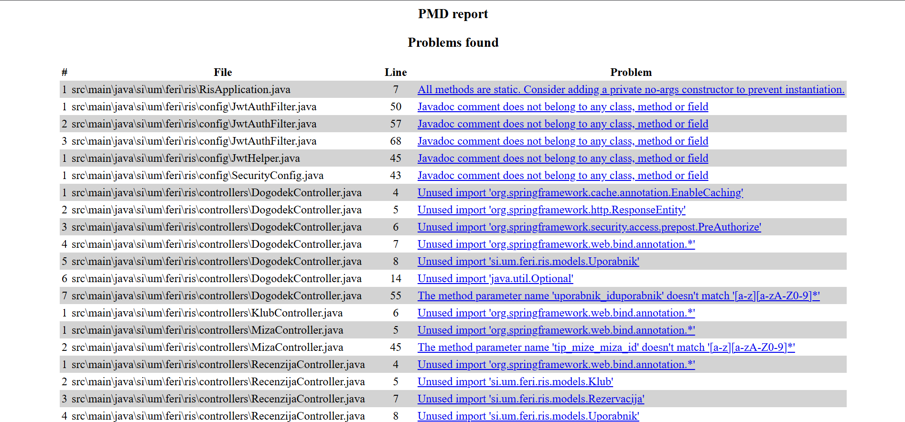
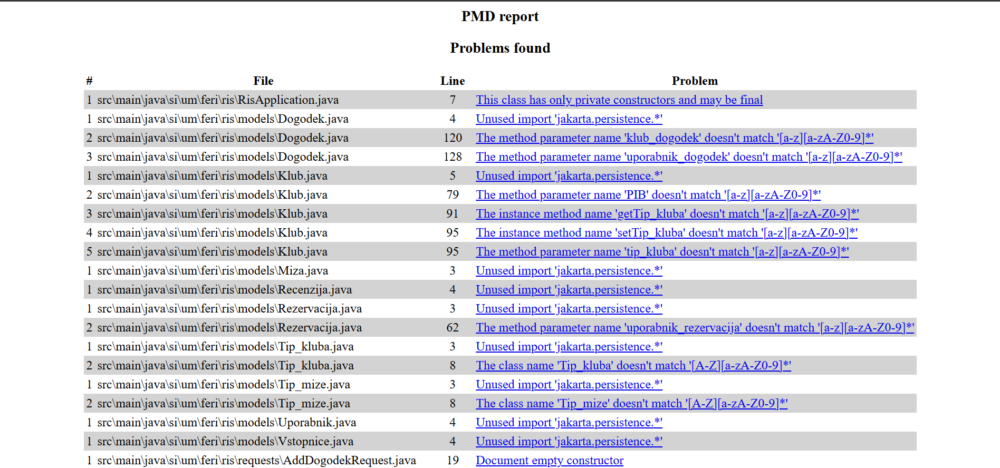

PMD analiza je bila izvedena nad mapo `src/main/java` z uporabo orodja
PMD 7.19.0 in pravil Java Quickstart. Analiza je zaznala večje število
opozoril, ki so se večinoma nanašala na neuporabljene uvoze, neustrezno
poimenovanje razredov, metod in parametrov ter pomanjkljivo dokumentacijo.

Najpogostejše zaznane težave so bile:
- neuporabljeni importi v kontrolerjih, modelih in repozitorijih,
- kršitve poimenovalnih konvencij (underscore v imenih),
- nepravilno postavljeni ali manjkajoči Javadoc komentarji,
- razredi z izključno statičnimi metodami brez zasebnega konstruktorja,
- opozorila glede upravljanja virov in odvečne kode.

## Identifikacija god razreda

Med analizo izvorne kode z orodjem PMD je bil zaznan razred
`DogodekService`, ki predstavlja primer t. i. *God class*.
Razred vsebuje več različnih odgovornosti, saj združuje poslovno logiko,
dostop do podatkov, obdelavo uporabnikov ter delo z zunanjimi viri
(datotekami).

Takšna zasnova krši načelo enotne odgovornosti (*Single Responsibility
Principle*), zaradi česar je razred težje razumljiv, vzdrževan in
razširljiv. Prisotna opozorila PMD dodatno nakazujejo na večjo kompleksnost
metod, neustrezno poimenovanje parametrov ter nepravilno upravljanje virov.

## Izvedeni refaktoring

1. **Refaktoring God razreda**

Razred DogodekService je bil prepoznan kot *God class*, saj je združeval
   več različnih odgovornosti. Refaktoring je vključeval razdelitev logike
   in izločitev preslikave podatkov v ločen razred DogodekMapper, s čimer
   je bila izboljšana berljivost in skladnost z načelom enotne odgovornosti.

2. **Odstranitev neuporabljenih uvozov**

V okviru refaktoringa so bili odstranjeni neuporabljeni uvozi v različnih
razredih aplikacije. S tem se je zmanjšalo število opozoril orodja PMD
ter izboljšala preglednost izvorne kode.

3. **Uskladitev poimenovalnih konvencij**

Refaktoring je vključeval uskladitev poimenovanja razredov, metod in
parametrov z Java konvencijami (camelCase in PascalCase). Odpravljene so
bile uporabe podčrtajev v imenih, kar je izboljšalo konsistentnost in
čitljivost kode.

4. **Izboljšanje dokumentacije (Javadoc)**

Orodje PMD je zaznalo nepravilno postavljene Javadoc komentarje, ki niso
pripadali nobenemu razredu ali metodi. Takšni komentarji so bili
odstranjeni ali ustrezno premaknjeni, kar je izboljšalo kakovost
dokumentacije.

5. **Izboljšanje upravljanja virov**

Pri refaktoringu razreda DogodekService je bila odstranjena logika,
povezana z neposrednim delom z viri. S tem so bila odpravljena opozorila
glede nepravilnega upravljanja virov, kar povečuje zanesljivost kode.

## Druga analiza kode

Po refaktoringu je v poročilu ostalo manjše število opozoril, ki se večinoma nanašajo na:

- poimenovalne konvencije v modelnih razredih (npr. uporaba podčrtajev v imenih razredov in metod),

- neuporabljene uvoze v modelih, ki so posledica širšega uvoznega nabora (jakarta.persistence.*),

- manjkajočo dokumentacijo praznih konstruktorjev v DTO razredih,

- opozorilo, da ima razred RisApplication samo privaten konstruktor in bi lahko bil označen kot final.

